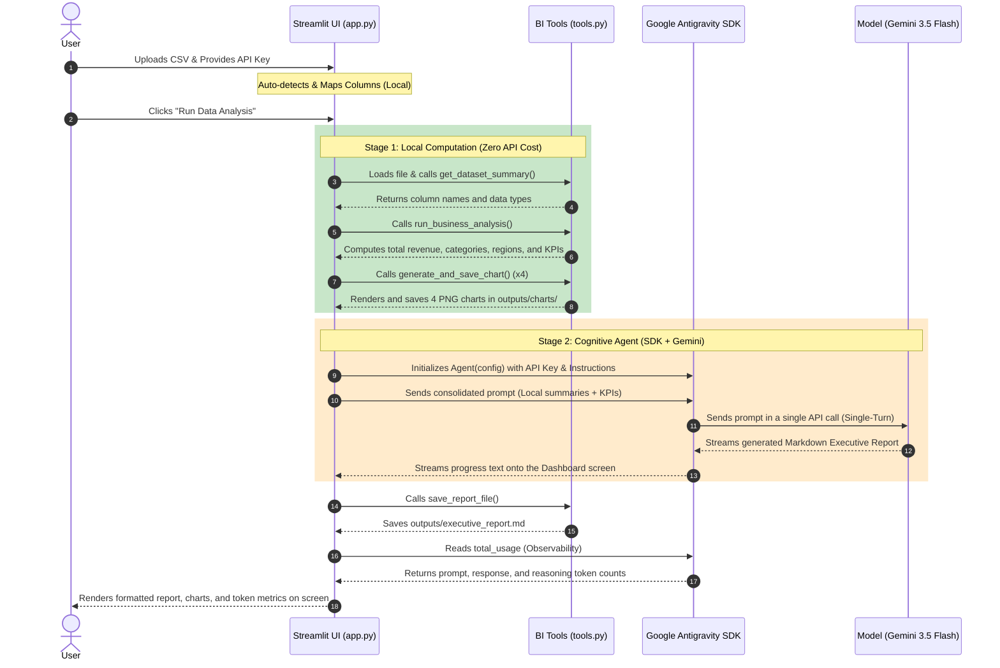

# Kaggle Capstone Project: Aegis Analytics - Autonomous BI Agent

This repository contains the capstone project submission for the **AI Agents: Intensive Vibe Coding Course with Google & Kaggle**.

---

## 🌟 Project Vision
**Aegis Analytics** is an Autonomous Business Intelligence (BI) and Data Analytics Agent designed to democratize access to high-quality business insights. It allows business users to upload raw data (CSV) and instantly receive:
1. Precisely computed **Performance Metrics (KPIs)**.
2. Clean, professionally styled **Statistical Charts and Visualizations**.
3. A comprehensive **Executive BI Report** generated by AI with actionable insights and strategic recommendations.

---

## 🔑 Gemini API Keys and Quota Management

### 1. When does the daily quota reset?
The daily request limit (Requests Per Day - RPD) for the Gemini API on the Free Tier resets at **midnight Pacific Time (00:00 PT)**. This corresponds to approximately **04:00 AM Brazilian Time (BRT)** the next day.

### 2. Is the API key required to run the project?
* **Local Analysis (Partial):** **No**, you do not need an API key to run the first half of the pipeline. Reading metadata, performing column mapping, computing means and revenues with Pandas, and generating charts with Matplotlib/Seaborn run entirely locally on your machine with zero network latency or API costs.
* **AI Insights and Final Report:** **Yes**, the Gemini API key is mandatory for this step. The cognitive processing (understanding the computed numbers, correlating revenue with trends, and writing strategic business recommendations) is performed by the `gemini-3.5-flash` model through the SDK.

---

## 🏗️ Architecture and Execution Flow

We adopted a **Hybrid Architecture (Multi-stage Pipeline)**. Separating the algorithmic calculations from the cognitive generation optimizes API costs and prevents rate-limit lockouts.

### Key Architectural Innovation: Dynamic Column Mapping (Zero API Cost)
To make the application robust and compatible with **any business sales CSV file**, the interface features a **Dynamic Column Mapping UI**:
* When a CSV is uploaded, the Pandas parser reads the header.
* An intelligent keyword-matching algorithm tries to **auto-detect** the columns (e.g. mapping "Faturamento" or "Revenue" to `Sales`, "Qtd" or "Quantidade" to `Units`).
* Dropdown lists are presented in the sidebar for manual validation/correction.
* Before passing files to the local tools and the agent, the data columns are normalized locally.
* **Cost:** 0 API calls.

### Execution Sequence Diagram



---

## 🧠 How does the SDK Agent Work Under the Hood?

The **Google Antigravity SDK** is an agent-first runtime layer that structures model orchestration and execution:

1. **LocalAgentConfig:** Defines agent execution properties, such as the system prompt (`system_instructions`), default model (`gemini-3.5-flash`), authentication, and lifecycle hooks.
2. **Conversation Manager:** The SDK manages chat history in a stateful session automatically. Instead of formatting prompts manually, the SDK structures message blocks for users, assistants, and tool return data.
3. **Lifecycle Hooks:** Allows developers to intercept execution points:
   * **Pre-tool & Post-tool Hooks:** Enables pauses (like the 15-second rate limiter) to control requests.
   * **Self-Correction:** If a graphical thread conflict occurs during plotting, the agent can catch the exception in the runtime and rewrite code dynamically, such as overriding the Matplotlib backend to `'agg'`.
4. **Observability (Token Usage):** Out-of-the-box token auditing. The `agent.conversation.total_usage` property exposes prompt tokens, response tokens, and **thinking tokens** (logic process tokens used by reasoning models), essential for cost management.

---

## 📁 Repository Structure

* [main.py](file:///Users/brunofaccoalmeida/Documents/google-agents-capstone/main.py): CLI terminal script.
* [app.py](file:///Users/brunofaccoalmeida/Documents/google-agents-capstone/app.py): Streamlit dashboard interface with dynamic mapping.
* `src/`:
  * [agent.py](file:///Users/brunofaccoalmeida/Documents/google-agents-capstone/src/agent.py): Agent initialization and configuration.
  * [tools.py](file:///Users/brunofaccoalmeida/Documents/google-agents-capstone/src/tools.py): Local Python tools (Pandas KPIs + Matplotlib plotting).
  * [generate_sample_data.py](file:///Users/brunofaccoalmeida/Documents/google-agents-capstone/src/generate_sample_data.py): Utility script to generate a synthetic sales dataset.
* `data/`: Datasets folder (contains mapped/raw files).
* `outputs/`: Output directory containing generated PNG charts and the final markdown report (`executive_report.md`).

---

## 🚀 Execution Instructions

### 1. Prerequisites
Ensure you have Python 3.10+ installed.

### 2. Environment Setup & Installation
Create a virtual environment and install the required dependencies:
```bash
python3 -m venv .venv
source .venv/bin/activate
pip install -r requirements.txt
```

### 3. API Key Setup
Create a `.env` file in the root directory and add your Google AI Studio API key:
```env
GEMINI_API_KEY="YOUR_API_KEY_HERE"
```

### 4. Running the CLI Script
To run the analysis pipeline in the terminal:
```bash
python main.py
```
This generates the charts under `outputs/charts/` and the report at `outputs/executive_report.md` (uses default synthetic schema).

### 5. Running the Streamlit Web App
To start the interactive dashboard:
```bash
streamlit run app.py
```
This automatically opens your browser at: [http://localhost:8501](http://localhost:8501) where you can upload and dynamically map any sales CSV dataset.
