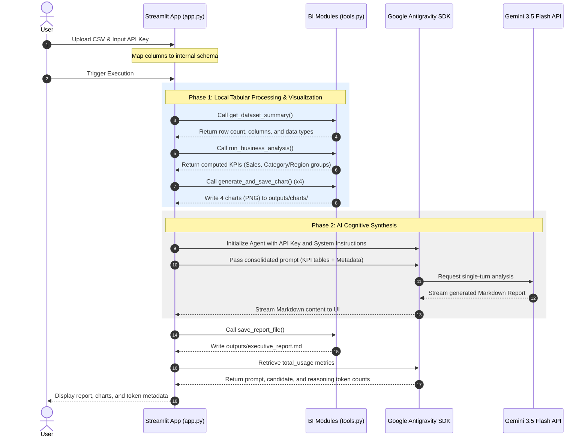

# Kaggle Capstone Project: Aegis Analytics - Autonomous BI Agent

This repository contains the capstone project submission for the AI Agents Intensive Course, developed in collaboration with Google and Kaggle.

---

## 1. Project Objectives and Value Proposition
Aegis Analytics is an autonomous Business Intelligence (BI) and Data Analytics Agent designed to bridge the gap between raw data storage and strategic decision-making. By leveraging state-of-the-art Large Language Models (LLMs) and local statistical tools, the system automates data profiling, KPI computation, high-resolution chart plotting, and the compilation of comprehensive executive reports containing actionable business recommendations.

---

## 2. API Key and Quota Management

### 2.1 Quota Reset Policy
The daily request limit (Requests Per Day - RPD) for the Gemini API on the Free Tier resets at midnight Pacific Time (00:00 PT), which corresponds to approximately 04:00 AM Brazilian Time (BRT).

### 2.2 Operational Key Dependencies
* **Local Processing Stage:** The system executes file ingestion, schema mapping, statistical aggregations (using Pandas), and chart rendering (using Matplotlib and Seaborn) locally. This stage runs entirely offline, incurring zero API costs or network latency.
* **Cognitive Processing Stage:** The Gemini API key is mandatory for the synthesis stage. The LLM (Gemini 3.5 Flash) is utilized through the SDK to analyze pre-computed statistics, extract business insights, and draft the final markdown report.

---

## 3. System Architecture and Design Patterns

To circumvent API rate limits (HTTP 429 - Resource Exhausted) on free-tier keys, Aegis Analytics implements a hybrid architecture. Instead of an interactive agent loop that queries tools sequentially (which consumes 10 to 15 API requests per run), this design consolidates data locally and invokes the model in a single execution turn.

### 3.1 Dynamic Column Mapping
To support arbitrary CSV schemas, the Streamlit interface includes a dynamic column mapper. It reads the CSV headers and employs a heuristic string-matching algorithm to auto-detect critical database fields (e.g., mapping "Faturamento" or "Revenue" to the internal variable `Sales`). If the auto-detection fails, users can manually override mappings via the interface. This normalization layer translates the dataset layout to a standardized internal schema prior to executing analytical tools.

### 3.2 Sequence Diagram of the Execution Pipeline



---

## 4. Google Antigravity SDK Core Components

The implementation integrates the Google Antigravity SDK to manage model interaction and monitor agent performance:

1. **LocalAgentConfig:** Configures the agent runtime, specifying the target model (`gemini-3.5-flash`), system instructions, API credentials, and lifecycle hooks.
2. **Conversation Lifecycle:** The SDK maintains the session history and manages context compaction behind the scenes.
3. **Execution Hooks:** Custom hooks intercept actions to build system robustness:
   * **Pre-tool & Post-tool Hooks:** Introduce automated pauses to throttle requests and respect rate limits.
   * **Error Interception and Recovery:** Catch exceptions (e.g., graphical display conflicts) and adjust configurations dynamically (such as switching Matplotlib to the non-interactive `'agg'` backend).
4. **Token Usage Auditing:** Promotes observability by extracting `agent.conversation.total_usage` metrics, allowing tracking of prompt tokens, response tokens, and reasoning tokens.

---

## 5. Repository Layout

* `main.py`: Main CLI entry point.
* `app.py`: Streamlit dashboard with dynamic mapping interface.
* `src/agent.py`: Agent configuration and API interaction logic.
* `src/tools.py`: Data analysis, math calculations, and plotting methods.
* `src/generate_sample_data.py`: Generator script for synthetic testing data.
* `data/`: Data storage directory (contains original and mapped datasets).
* `outputs/`: Output directory containing generated PNG charts and the final markdown document (`executive_report.md`).

---

## 6. Setup and Execution Guide

### 6.1 Dependency Installation
Initialize the virtual environment and install the required dependencies:
```bash
python3 -m venv .venv
source .venv/bin/activate
pip install -r requirements.txt
```

### 6.2 Environment Setup
Create a `.env` file in the root directory:
```env
GEMINI_API_KEY="YOUR_API_KEY_HERE"
```

### 6.3 Command Line Interface Execution
To run the analysis pipeline inside the terminal:
```bash
python main.py
```

### 6.4 Streamlit Dashboard Execution
To start the web interface:
```bash
streamlit run app.py
```
Access the local interface at: http://localhost:8501
